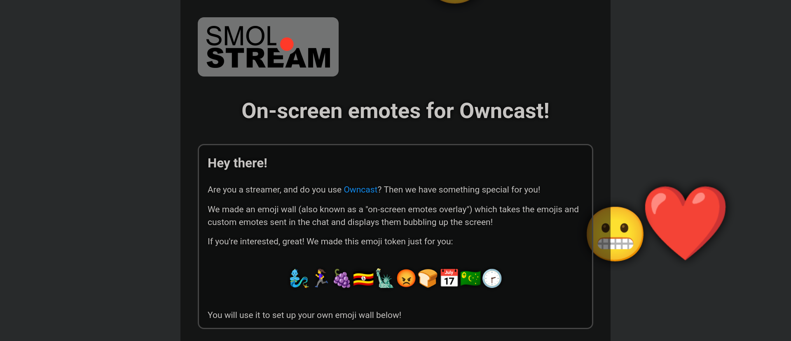

<!--
N.B.: Questo README è stato automaticamente generato da <https://github.com/YunoHost/apps/tree/master/tools/readme_generator>
NON DEVE essere modificato manualmente.
-->

# Emojiwall for Owncast per YunoHost

[](https://dash.yunohost.org/appci/app/owncast-emojiwall)  

[](https://install-app.yunohost.org/?app=owncast-emojiwall)

*[Leggi questo README in altre lingue.](./ALL_README.md)*

> *Questo pacchetto ti permette di installare Emojiwall for Owncast su un server YunoHost in modo semplice e veloce.*  
> *Se non hai YunoHost, consulta [la guida](https://yunohost.org/install) per imparare a installarlo.*

## Panoramica

The emoji wall (also known as a "on-screen emotes overlay") takes the emojis and custom emotes sent in the chat of Owncast streamers and displays them bubbling up the screen!


**Versione pubblicata:** 1.1.3~ynh1

## Screenshot



## Documentazione e risorse

- Sito web ufficiale dell’app: <https://smol.stream/emojiwall>
- Repository upstream del codice dell’app: <https://framagit.org/owncast-things/owncast-emojiwall>
- Store di YunoHost: <https://apps.yunohost.org/app/owncast-emojiwall>
- Segnala un problema: <https://github.com/YunoHost-Apps/owncast-emojiwall_ynh/issues>

## Informazioni per sviluppatori

Si prega di inviare la tua pull request alla [branch di `testing`](https://github.com/YunoHost-Apps/owncast-emojiwall_ynh/tree/testing).

Per provare la branch di `testing`, si prega di procedere in questo modo:

```bash
sudo yunohost app install https://github.com/YunoHost-Apps/owncast-emojiwall_ynh/tree/testing --debug
o
sudo yunohost app upgrade owncast-emojiwall -u https://github.com/YunoHost-Apps/owncast-emojiwall_ynh/tree/testing --debug
```

**Maggiori informazioni riguardo il pacchetto di quest’app:** <https://yunohost.org/packaging_apps>
